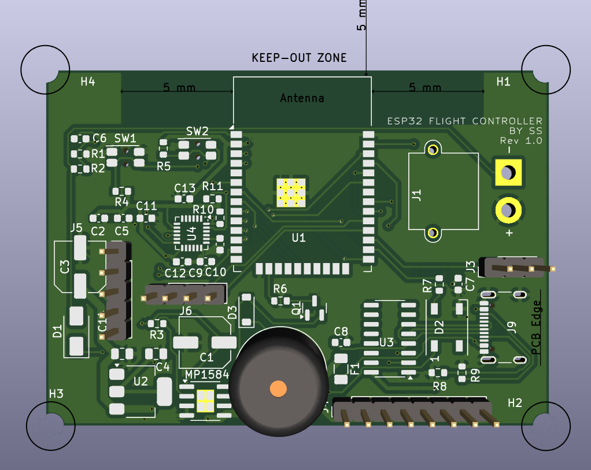
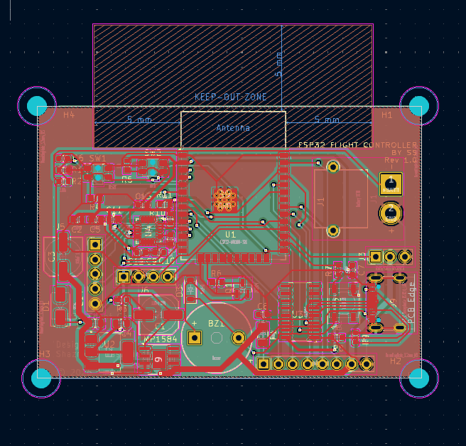
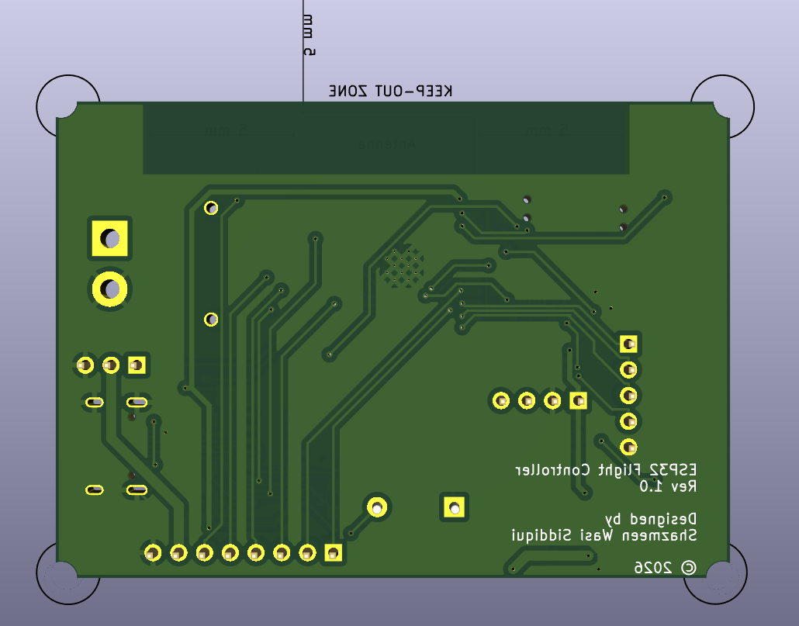
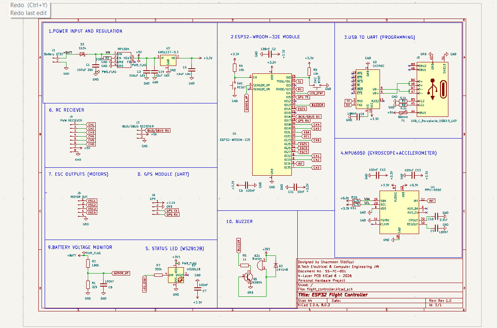

# ESP32 Flight Controller

<p align="center">
  
</p>

> A custom 4-layer IoT-ready ESP32-based Flight Controller designed in KiCad 8 for UAV and robotics applications.


---

# Overview

This project is a custom-designed 4-layer ESP32-based Flight Controller PCB developed in KiCad 8. Built around the ESP32-WROOM-32E, the board integrates power management, sensor interfaces, USB programming, and wireless connectivity capabilities, making it suitable for UAVs, robotics, and IoT-enabled embedded systems.

The design follows industry-standard PCB practices, including dedicated ground and power planes, RF antenna keep-out, proper decoupling, and comprehensive Design Rule Checking (DRC), resulting in a manufacturing-ready hardware platform.

---

# Applications

- UAV & Drone Flight Controllers
- IoT-enabled Robotics
- Wireless Sensor Nodes
- Remote Monitoring Systems
- Autonomous Embedded Platforms
- Research & Academic Projects
- Rapid Prototyping for Embedded Systems

---

# Features

- ESP32-WROOM-32E Microcontroller
- Wi-Fi & Bluetooth Enabled (ESP32)
- IoT-Ready Embedded Hardware Platform
- 4-Layer PCB Design
- USB Type-C Programming Interface
- CH340C USB-to-UART Converter
- MP1584 Buck Converter (Battery to 5V)
- AMS1117-3.3V Linear Regulator
- MPU6050 6-Axis IMU Interface
- GPS UART Interface
- SBUS/iBUS Receiver Interface
- Battery Voltage Monitoring
- WS2812B Addressable RGB Status LED
- Active Buzzer Interface
- Boot & Reset Buttons
- Mounting Holes
- RF Antenna Keep-Out Zone
- Ground and Power Copper Planes
- DRC Clean (0 Errors, 0 Warnings)

---

# Hardware Specifications

| Parameter | Specification |
|-----------|---------------|
| MCU | ESP32-WROOM-32E |
| PCB Layers | 4 |
| Power Input | LiPo Battery |
| Buck Converter | MP1584 |
| LDO Regulator | AMS1117-3.3V |
| USB Interface | USB Type-C |
| USB-UART | CH340C |
| IMU | MPU6050 |
| Receiver | SBUS / iBUS |
| GPS | UART |
| Battery Monitor | Voltage Divider |
| Status Indicator | WS2812B RGB LED |
| Buzzer | Active Buzzer |
| CAD Software | KiCad 8 |

---

# PCB Stack-Up

Layer 1
```
Top Signal Layer
```

Layer 2
```
Ground Plane
```

Layer 3
```
Power Plane
```

Layer 4
```
Bottom Signal Layer
```

---

# Power Architecture

```
LiPo Battery
      │
      ▼
   MP1584
 (Buck Converter)
      │
      ▼
      5V
      │
      ▼
 AMS1117-3.3V
      │
      ▼
     ESP32
```

---

# Interfaces

| Interface | Purpose |
|------------|---------|
| USB Type-C | Programming & Power |
| UART | GPS |
| SBUS/iBUS | RC Receiver |
| I²C | MPU6050 |
| ADC | Battery Voltage Monitoring |
| GPIO | WS2812B & Buzzer |

---

# Design Highlights

- Dedicated Ground Plane
- Dedicated Power Plane
- RF Antenna Keep-Out
- Proper Decoupling Capacitors
- Copper Pour Optimization
- Manual PCB Routing
- Differential USB Routing
- Professional Silkscreen
- Optimized Component Placement
- Manufacturing Ready

---

# Design Workflow

- Component Selection
- Schematic Design
- ERC Verification
- Footprint Assignment
- PCB Layout
- Component Placement
- Net Class Assignment
- Manual Routing
- Copper Pour
- DRC Verification
- Gerber Generation

---

# Repository Structure

```
ESP32-Flight-Controller
│
├── Hardware
│   ├── flight_controller.kicad_pro
│   ├── flight_controller.kicad_sch
│   ├── flight_controller.kicad_pcb
│
├── Gerbers
│
├── Images
│   ├── PCB_Top.png
│   ├── PCB_Bottom.png
│   ├── 3D_Top.png
│   ├── 3D_Bottom.png
│   └── Schematic.png
│
├── BOM
│
└── README.md
```

---

# Project Status

- [x] Schematic Design
- [x] PCB Layout
- [x] Footprint Assignment
- [x] 4-Layer PCB
- [x] Manual Routing
- [x] Ground Copper Pour
- [x] Power Copper Plane
- [x] DRC Passed
- [x] Manufacturing Ready

---

# Images

## PCB Layout

<p align="center">
  
</p>

---

## 3D View

<p align="center">
  
  
</p>

---

## Schematic

<p align="center">
  
</p>

---

# Future Improvements

- BMP280/BME280 Barometer
- Magnetometer Support
- Current Sensor
- Blackbox Logging
- CAN Interface
- ESD Protection
- Reverse Polarity Protection

---

# Tools Used

- KiCad 8
- ESP32-WROOM-32E
- CH340C
- MP1584
- AMS1117
- MPU6050

---

# Author

**Designed & Developed by**

**Shazmeen Wasi Siddiqui**

B.Tech — Electrical & Computer Engineering

Jamia Millia Islamia

---

# License

This project is released under the **MIT License**.

---

---

# Hardware Revisions

## Rev 1

The original ESP32 Flight Controller hardware design is maintained in the root of this repository. It represents the first manufactured prototype of the project.

## Rev 2

Rev 2 is the second hardware revision of the ESP32 Flight Controller. The complete Rev 2 design and manufacturing files are provided under the `Rev2/` directory.

### Rev 2 Contents

- KiCad schematic and PCB design files
- Gerber manufacturing files
- Bill of Materials (BOM)
- Drill files and manufacturing documentation
- PCB images and photographs

### Manufacturing Support

The Rev 2 PCB was manufactured with support from **NextPCB** through their project sponsorship program.

**Manufacturing Partner:** NextPCB  
**Sponsored Revision:** Rev 2

---

## Rev 2 Repository Structure

```text
Rev2/
├── KiCad/
├── Gerbers/
├── BOM/
├── Documentation/
└── Images/